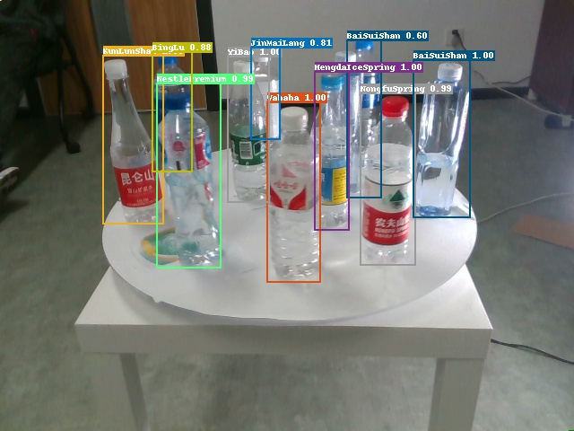
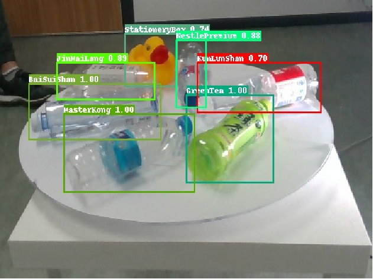
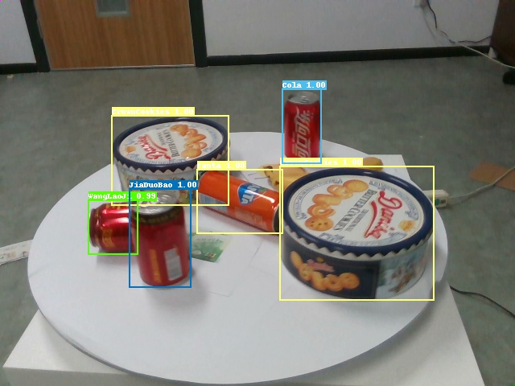

[English](docs/README_en.md) | __简体中文__

# 基于PaddleDetection的CascadeR-CNN

[PaddleDetection]: https://github.com/PaddlePaddle/PaddleDetecion

## 简介

本项目是我大二的深度学习课程设计的课题，内容是实现[CascadeR-CNN](https://arxiv.org/pdf/1712.00726.pdf)网络模型。

本项目中，模型构建、训练、测试、导出均基于[PaddleDetection]实现。

我在本项目的基础上开发的作品“视觉结算台——商品自动结算系统”获得了2022年
[中国大学生计算机设计大赛](http://jsjds.blcu.edu.cn/)全国二等奖。

我的作品“视觉结算台——商品自动结算系统”因数据集版权和竞赛组委会要求等原因暂时不能开源。

下面3张图片是“视觉结算台——商品自动结算系统”作品基于本项目得到的识别结果。

  

## 使用教程

### 1.克隆项目

```shell
git clone https://github.com/Yue-0/CascadeRCNN.git
cd ./CascadeRCNN
```

以下命令如无特殊说明，均在CascadeRCNN目录下进行。

### 2.安装依赖

```shell
bash install.sh
```

### 3.准备数据集

目前仅支持COCO格式的数据集，
将训练图片放置在dataset/train/目录下，测试图片放置在dataset/test目录下，
并将标注文件放置在dataset目录下，命名为train.json和test.json。

### 4.训练

```shell
bash train.sh
```

训练完毕后，参数文件（后缀为pdparams）会保存在model文件夹中。

### 5.测试

```shell
bash test.sh
```

默认输出COCO格式的评价指标。

### 6.推理

将需要推理的图片放置在inputs文件夹中，执行以下命令进行推理：

```shell
bash inference.sh
```

推理得到的结果会保存在outputs文件夹中。

### 7.导出模型

部署模型时，需要先导出模型，使用[PaddleDetection]可以导出多种类型的模型文件，这里提供导出为PaddleInference模型的方法：

```shell
bash export.sh
```

导出的模型保存在model/Cascade_RCNN文件夹中。

### 8.调用模型

导出模型后，即可在python代码中调用Cascade R-CNN模型。

以下python代码在CascadeRCNN的上级目录运行：

```python
import cv2
import numpy as np

from CascadeRCNN import CascadeRCNN

model = CascadeRCNN("CascadeRCNN/model/Cascade_RCNN", threshold=0.5)
image = np.uint8(np.random.randint(0, 255, (1024, 1024, 3)))  # BGR image
image = cv2.cvtColor(image, cv2.COLOR_BGR2RGB)  # BGR mode to RGB mode
result = model(image)
print(result.shape)  # (N, 6)
# N: number of objects;
# 6: [class, confidence, x_min, y_min, x_max, y_max].
```

## 参考文献
1. Cai Z, Vasconcelos N. Cascade R-CNN: Delving into High Quality Object Detection.
2. PaddleDetection. https://github.com/PaddlePaddle/PaddleDetection.
