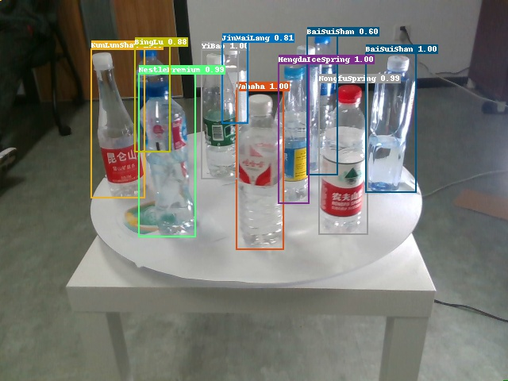
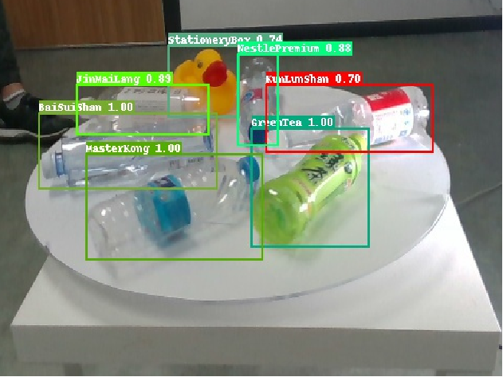

__English__ | [简体中文](../README.md)

# Cascade R-CNN based on PaddleDetection

[PaddleDetection]: https://github.com/PaddlePaddle/PaddleDetecion

## Brief Introduction

This project is my sophomore deep learning curriculum design project.

In this project, model construction, training,
testing and export are all based on [PaddleDetection].

My work "Visual Settlement Desk - Automatic Commodity Settlement System"
developed on the basis of this project won the second prize in the 2022
[Chinese Collegiate Computing Competition](http://jsjds.blcu.edu.cn/).

The source code of my work "Visual Settlement Desk - Automatic Commodity
Settlement System" cannot be released temporarily due to the copyright of the
dataset and the requirements of the competition organizing committee.

The following 3 pictures are the recognition results of the work
"Visual Settlement Desk - Automatic Commodity Settlement System"
based on this project.

  

## Course

### 1.Clone

```shell
git clone https://github.com/Yue-0/CascadeRCNN.git
cd ./CascadeRCNN
```

The following commands are executed in the "CascadeRCNN" directory unless otherwise specified.

### 2.Install requirements

```shell
bash install.sh
```

### 3.Prepare dataset

Currently, only datasets in COCO format are supported.
Place the train images in the "dataset/train/", and the test images in the "dataset/test".
Place the annotation file in the "dataset" directory and name it "train.json" and "test.json".

### 4.Train

```shell
bash train.sh
```

After training, the parameter file (.pdparams) will be saved in the "model" directory.

### 5.Evaluate

```shell
bash test.sh
```

The evaluation index in COCO format is output by default.

### 6.Inference

Place the images to be inference in the "inputs" directory,
and execute the following command to inference:

```shell
bash inference.sh
```

The result of inference will be saved in the "outputs" directory.

### 7.Export model

When deploying a model, you need to export the model first.
You can export multiple types of model files using [PaddleDetection].
Here is the method to export as PaddleInference model:

```shell
bash export.sh
```

The exported model is saved in "model/Cascade_RCNN" directory.

### 8.Call model

After exporting the model, you can call the Cascade R-CNN model in python code.

The following python code runs in the superior directory of CascadeRCNN:

```python
import cv2
import numpy as np

from CascadeRCNN import CascadeRCNN

model = CascadeRCNN("CascadeRCNN/model/Cascade_RCNN", threshold=0.5)
image = np.uint8(np.random.randint(0, 255, (1024, 1024, 3)))  # BGR image
image = cv2.cvtColor(image, cv2.COLOR_BGR2RGB)  # BGR mode to RGB mode
result = model(image)
print(result.shape)  # (N, 6)
# N: number of objects;
# 6: [class, confidence, x_min, y_min, x_max, y_max].
```

## References
1. Cai Z, Vasconcelos N. Cascade R-CNN: Delving into High Quality Object Detection.
2. PaddleDetection. https://github.com/PaddlePaddle/PaddleDetection.
